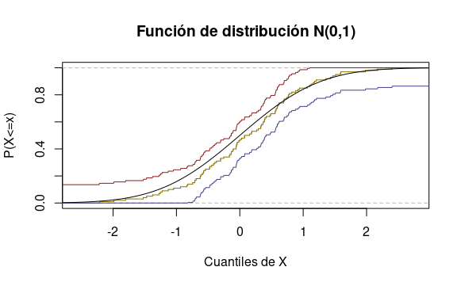

#(Computer Experiment.)

Generate 100 observations from a $N(0,1)$ distribution. Compute a 95 percent confidence band for the CDF $F$. Repeat this 1000 times and see how often the confidence band contains the true distribution function. Repeat using data from a Cauchy distribution.


1) Caso: $N(0,1)$. Solución: 

Se simuló 100 observaciones de una normal estándar de la semilla 1. En la imagen se muestran:

- Una linea dorada que reprenta la distribución estimada.
- Una linea negra que representa la distribución real.
- La linea roja y azul representan los límites superior e inferior (respectivamente) de la banda de confianza al $95\%$. 


Se repitió lo anterior 1000 veces con las semillas 2 hasta 1001 y se alcanzo una cobertura de $\frac{956}{1000} \approx 95.6\%$. 


Se muestra el código:

````{r include = TRUE}
puntos = (1:1000-500)/500
alfa = 0.05
n = 100
en = sqrt(log(2/alfa)/(2*n))

contenciones = sapply(2:1001, function(i){
  set.seed(i)
  X = rnorm(n)
  Fhat = ecdf(X)
  puntos = max(abs(X) + 0.001)*puntos
  UB = sapply(puntos, function(p){min(c(Fhat(p)+en,1))})
  LB = sapply(puntos, function(p){max(c(Fhat(p)-en,0))})
  Freal = pnorm(puntos)
  limsup = (Freal<=UB)
  liminf = (LB <= Freal)
  all(apply(cbind(liminf,limsup), 1, all))
})

table(contenciones)

````

-----------------------------------------------------------------------------------------
2) Caso $Cauchy(0,1)$. Solución:

Se simuló 100 observaciones de una normal estándar de la semilla 3. En la imagen se muestran:

- Una linea dorada que reprenta la distribución estimada.
- Una linea negra que representa la distribución real.
- La linea roja y azul representan los límites superior e inferior (respectivamente) de la banda de confianza al $95\%$. 


Se repitió lo anterior 1000 veces con las semillas 2 hasta 1001 y se alcanzo una cobertura de $\frac{978}{1000} \approx 97.8\%$.

Se muestra el código:
````{r include = TRUE}
puntos = (1:1000-500)/500
alfa = 0.05
n = 100
en = sqrt(log(2/alfa)/(2*n))

contenciones = sapply(4:1003, function(i){
  set.seed(i)
  X = rcauchy(n)
  Fhat = ecdf(X)
  puntos = max(abs(X) + 0.001)*puntos
  UB = sapply(puntos, function(p){min(c(Fhat(p)+en,1))})
  LB = sapply(puntos, function(p){max(c(Fhat(p)-en,0))})
  Freal = pcauchy(puntos)
  limsup = (Freal<=UB)
  liminf = (LB <= Freal)
  all(apply(cbind(liminf,limsup), 1, all))
})

table(contenciones)

````