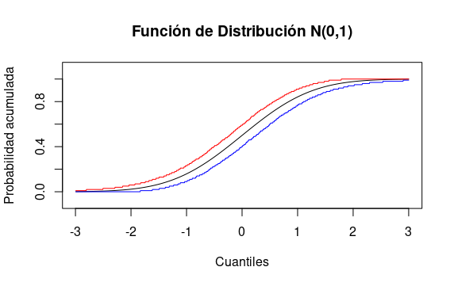
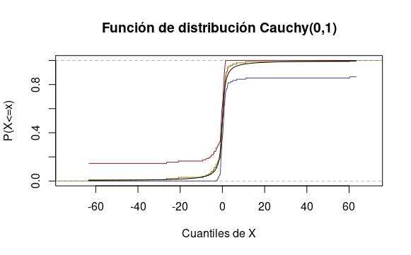

#(Computer Experiment.)

Generate 100 observations from a $N(0,1)$ distribution. Compute a 95 percent confidence band for the CDF $F$. Repeat this 1000 times and see how often the confidence band contains the true distribution function. Repeat using data from a Cauchy distribution.

1) Caso: $N(0,1)$. Solución: 

2) Caso $Cauchy(0,1)$. Solución:

