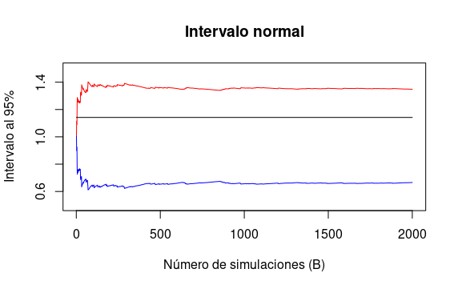
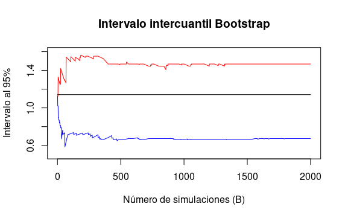
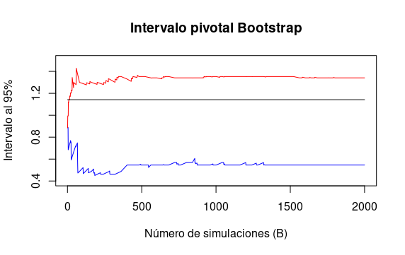

Let $X_1,\dots, X_n \sim t_{(3)}$ where $n = 25$. Let $\theta = T(F) = (q_{.75} − q_{.25})/1.34$ where $q_p$ denotes the $p$ th quantile. Do a simulation to compare the coverage and length of the following confidence intervals for $\theta$:

(i) Normal interval with standard error from the bootstrap.

(ii) bootstrap percentile interval.

(iii) pivotal bootstrap interval.

Solución:

Fijando la semilla 1, el estimador puntual fue 1.006827.

````{r include = TRUE}
alfa = 0.05

#Intervalo normal
set.seed(1)
n = 25
(X = rt(n,df = 3))
cuantilesN = quantile(x = X, probs = c(0.25,0.75))
(largo = (cuantilesN[2] - cuantilesN[1])/1.34)
````

-----------------------------------------------------------------------------------------
Así fijando el número de simulaciones Bootstrap en B=10000; se obtuvieron los siguientes intervalos con $\alpha = 5\%$:

````{r include = TRUE}
#Varianza Bootstrap
B = 10000
TnB = sapply(1:B, function(b){
  Xb = sample(X,n,replace = TRUE)
  cuantb = quantile(x = Xb, probs = c(0.25,0.75))
  largoB = (cuantb[2] - cuantb[1])/1.34
  return(largoB)
})

VarB = mean((TnB - mean(TnB))^2)

#Intervalo normal
(InfN = largo - qnorm(1-alfa/2)*sqrt(VarB))
(SupN = largo + qnorm(1-alfa/2)*sqrt(VarB))
````
  
Intervalo normal = (0.6804892,1.333164). Largo = 0.6526748.

-----------------------------------------------------------------------------------------

````{r include = TRUE}
#Intervalo de los cuantiles Bootstrap
(IntervaloB = quantile(x = TnB, probs = c(alfa/2,1-alfa/2)))
````

Intervalo intercuantil Bootstrap = (0.6725537, 1.3004509). Largo = 0.6278972.

------------------------------------------------------------------------------------------

````{r include = TRUE}
#Intervalo del Bootstrap pivotal
(InfBpiv = 2*largo - IntervaloB[2])
(SupBpiv = 2*largo - IntervaloB[1])
````

Intervalo pivotal Bootstrap = (0.7132023, 1.341099). Largo = 0.6278972.

Donde el estadístico "real" es 1.14163.

Conclusiones:


1) El intervalo normal siempre va estar centrado en el estimador y en este caso particular fue más conservador por tener la mayor longitud.

2) Los intervalos Boostrap tienen la misma longitud pero difieren en su centro (en general diferente del estimador puntual).

3) Todos los intervalos contenen el valor real.

Ahora evaluaremos la convergencia de los métodos sobre el número de simulaciones (B que corre de 1 a 10,000) con la misma semilla y por lo tanto, la misma muestra de tamaño 25.

A continuación se muestran tres gráficas que muestran la convergencia de los intervalos al $95\%$ variando el número de simulaciones utilizadas.

- La linea roja representa el límite superior.
- La linea azul el límite interior.
- La lina negra el valor real.





Conclusión:

En este caso particular, toods los intervalos requisieron al rededor de 1500 simulaciones o más para converger, aunque cubrieron el parámetro de interes con relativa velocidad.
